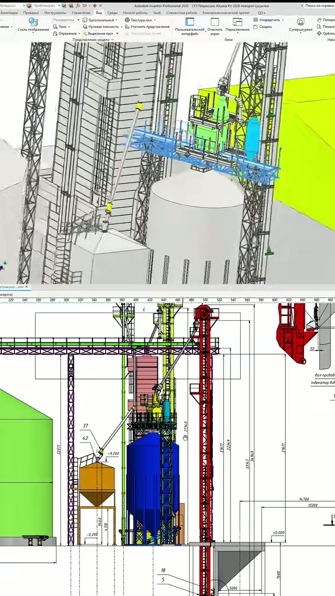
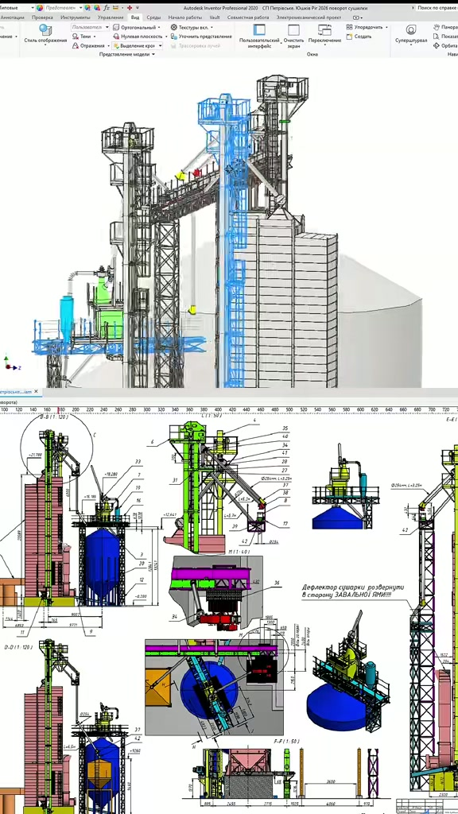
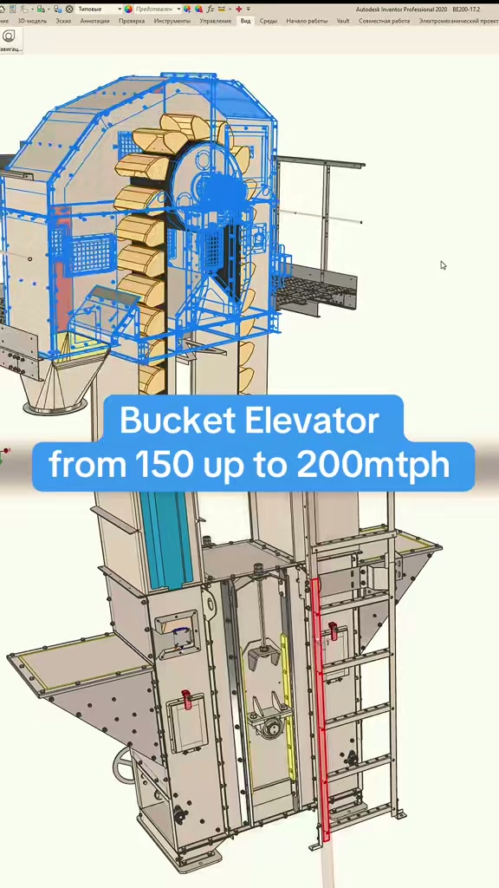
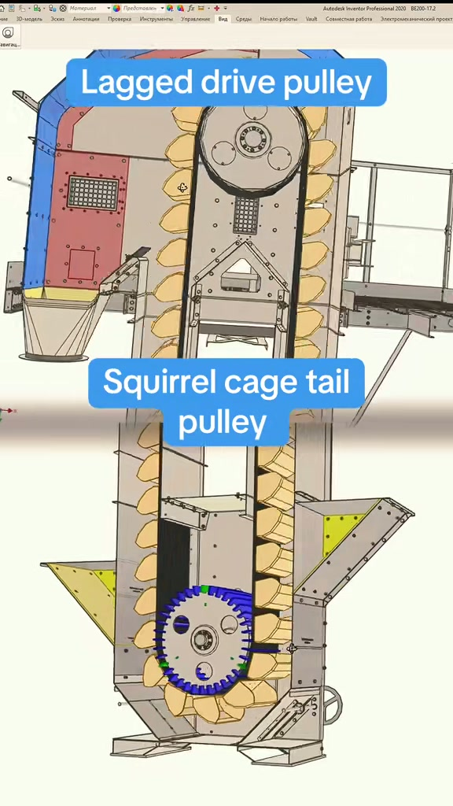
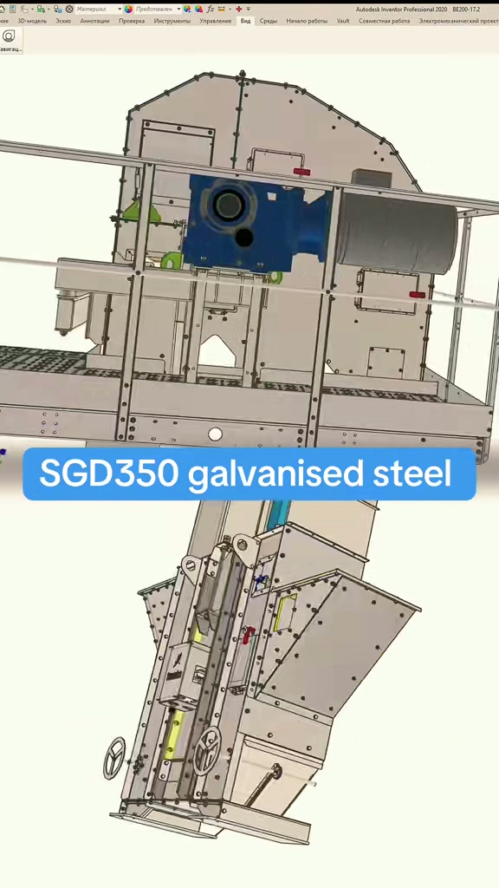
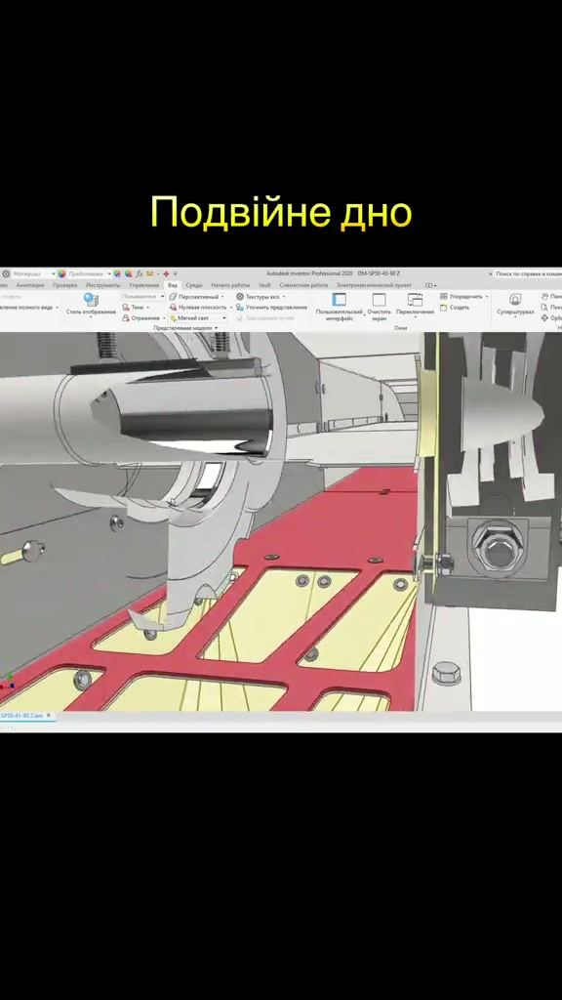

# Канон деталізації

Дата: 2026-09-23
Статус: обов’язковий візуальний рівень для всього, що ми називаємо елеватором.
Джерело: три ролики Олександра Панаса, розібрані покадрово. Це не наш об’єкт і не наші розміри. Це зразок того, з яких частин зібрана машина.

Гладкий циліндр `blender/silo_msvu_220/` лишається першим етапом: перевірена оболонка 22.000 × 21.422 м, плоске днище. Він не є результатом. Наступна модель без пунктів цього канону не приймається, навіть якщо діаметр збігся.

---

## Що це за ролики

Усі три — запис екрана **Autodesk Inventor Professional 2020**, не Blender і не згенероване відео. Зверху або на весь кадр крутиться 3D-збірка. Де треба, знизу лежить креслення з розмірами. Автор підписує вузол текстом. Мова моделі: листи, фланці, ряди болтів, розріз кожуха, щоб було видно нутро.

| Ролик | Тривалість | Про що кадр |
|---|---|---|
| [7679488252880932116](https://www.tiktok.com/@aleksandrpanas/video/7679488252880932116) | 17 с | Цілий комплекс Demetra в Inventor і розріз креслення під ним |
| [7678622609449291029](https://www.tiktok.com/@aleksandrpanas/video/7678622609449291029) | 18 с | Норія 150–200 т/год у розрізі: ковші, барабани, болти, драбина |
| [7676195272459963669](https://www.tiktok.com/@aleksandrpanas/video/7676195272459963669) | 52 с | Z-транспортер: подвійне дно, болти, Hardox, ланцюг |

Кадри лежать у `canon/detail/`. Аудіо в роликах не несе окремої лекції: зміст написаний на кадрі і в підписі TikTok.

---

## Рівні. Де ми стоїмо

**Рівень 0. Оболонка.** Те, що вже зібрано. Циліндр заданого діаметра і висоти, плоский диск підлоги, плоска кришка. Жодної гофри, жодного болта. Для перевірки розміру цього досить. Для показу елеватора цього мало.

**Рівень 1. Майданчик.** Те, що видно на загальному плані першого ролика, навіть коли силос ще гладкий: кілька ємностей, норійні вежі з горизонтальними поясами листів, ґратчасті опори, галерея, сходи, майданчики з огорожею, самопливи, операторські будки, фундаментні плити. Поруч креслення з відмітками і розрізом.

**Рівень 2. Машина.** Те, на чому автор зупиняє камеру. Це і є канон «готово».

Норія на кадрах `03`–`05`:

- кожух з окремих листів, стик іде фланцем, по фланцю ряд болтів
- оглядові люки і дверцята з власним рядом кріплення
- драбина і оглядовий майданчик з ґратчастим настилом і поручнем
- розріз голови: привідний барабан, стрічка, ряд ковшів
- розріз башмака: натяжний барабан типу «біляче колесо», ковші зачерпують знизу
- футерування барабана, датчики, оцинкований лист (у підписі S350GD)

Z-транспортер на кадрі `06`:

- дно з двох шарів, верхній шар з вікнами
- болт з гайкою і шайбою читається як деталь, не як точка
- скребок і ланцюг у коробі
- траса ламається під кутом, щоб зайти під бункер

Силос у цьому каноні не «бочка». На вежах першого ролика стіна читається поясами. На норії кожен лист має край і кріплення. Наш наступний силос приймається тільки коли з камери видно: горизонтальні пояси листів, вертикальний стик і ряд кріплення на стику. Гладка труба з написом «немає факту» цей рівень не закриває.

---

## Що беремо в роботу, а що ні

Беремо як обов’язковий склад моделі:

1. Стіна силоса з поясів, не одна поверхня.
2. Вертикальний стик поясів з рядом болтів.
3. Дах окремими секторами, навіть поки кут ухилу невідомий. Плоский диск лишається тимчасовою кришкою рівня 0.
4. Норія пізніше: голова, шахта з листів, башмак, стрічка, ковші, два барабани, драбина, майданчик. Шахта без розрізу, в якому не видно ковша, не приймається.
5. Галерея, опора, сходи з’являються разом із другим і третім вузлом, не замість стіни силоса.

Не беремо як наші розміри:

- висоти і діаметри з креслень Demetra на цих кадрах
- продуктивність 150–200 т/год тієї норії
- крок гофри, якого в кадрі немає числом
- Hardox, ланцюг 81ХН, Maxi-Lift як факт нашого МСВУ

Число в модель потрапляє як і раніше: тільки з картки. Пояс і болт можна показати як тип конструкції. Крок пояса і діаметр болта лишаються підписом «крок не з паспорта», доки не буде документа. Вигаданий «типовий» крок 76 мм чи 114 мм у канон не входить.

---

## Кадри

---

## Правило приймання наступної моделі

Модель силоса прийнята на рівень 2, коли на одному кадрі одночасно видно:

- зовнішній діаметр 22.000 м і висоту стіни 21.422 м, як і зараз
- не менше двох горизонтальних поясів, шов між ними читається
- один вертикальний стик з рядом кріплень
- плоске днище, без конуса
- підпис, які розміри пояса і болта ще не з паспорта

Поки цього кадру немає, у нас є перевірена заготовка, не елеватор.
