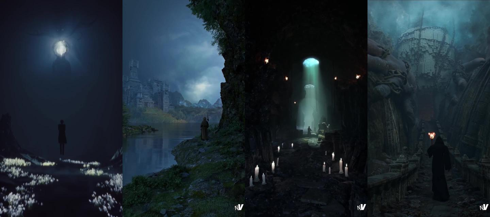
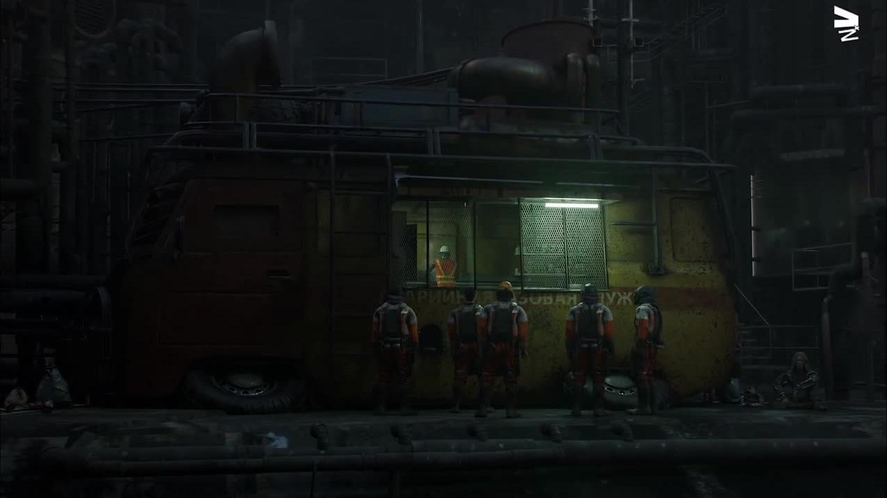

# Канон світу: рівень «як у дорогій грі»

Дата: 2026-09-24
Джерело: 5 рілсів автора **vfxbynikhil** (Instagram), розібрані покадрово (2 кадри/с, пошук склейок). Це не наш об'єкт. Це зразок того, як виглядає і як монтується сцена, що «виглядає як гра».
Канон деталізації вузлів — `CANON_DETAIL.md` (Панас). Цей канон — про світ, світло, атмосферу, камеру і формат ролика.

## Ролики

| # | Назва | Тривалість | Що в кадрі | Фінальний кадр |
|---|---|---|---|---|
| V1 | Did I master Blender? The Fool (Octane) | 32 с | меч і магічні кола з картинки → частинки → істота, персонаж, тканина, дим → фінал | темрява, туман, світні кола, силует, промінь зверху |
| V2 | The last castle standing (Blender 4.0) | 26 с | тканина на персонажі → скульпт рельєфу → готовий замок → розсип каміння і рослин пензлем → фінал | блакитна година, хмари, вода з відбиттям, три плани глибини |
| V3 | Did I cook… | 18 с | сірий скульпт колони → зал з арками (greybox) → фінал | темний інтер'єр, один об'ємний промінь з отвору в стелі, свічки |
| V4 | Some doors aren't opened willingly | 13 с | розфарбування текстур пензлем, руки статуй з ланцюгами, тканина на ходу → фінал | туманні руїни, фігура зі смолоскипом іде від камери |
| V5 | Rate the cook: Viewport vs Render | 12 с | **промисловий** greybox: труби, фургон, робітники в касках → «поверни телефон» → фінал | темний цех, одне вікно з лампою денного світла, бруд, кирилиця на фургоні |

Кадри: `canon/world/`.

## Що робить кадр «ігровим». Спільне для всіх п'яти

1. **Світло одне, а решта — темрява.** Жоден фінал не освітлений рівно. Є одне джерело (промінь, вікно, смолоскип, місяць), і кадр побудовано навколо нього. Тіні глибокі, чорні ділянки не витягнуто.
2. **Об'ємний туман скрізь.** Повітря має густину: дальні плани блідішають і синіють, промінь видно в повітрі. Це головна різниця між «рендером» і «світом».
3. **Три плани глибини.** Передній темний (скеля, колона, край труби), середній з героєм, дальній у тумані. V2 — підручниковий приклад.
4. **Людина в кадрі для масштабу, спиною до камери.** У всіх п'яти є маленька фігура. Вона одразу дає розмір і «історію», і для неї не потрібна анімація обличчя.
5. **Колір: холодна основа і тепле джерело.** Синьо-бірюзова тінь проти помаранчевого вогню або білого холодного променя. Кольорова корекція сильна.
6. **Бруд і знос.** V5: іржа, патьоки, грязь на колесах, стерта фарба, написи. Чисте виглядає як CAD.
7. **Камера майже стоїть.** Фінали — 5–15 секунд повільного наїзду або статичного плану з рухом усередині (дим, частинки, фігура йде). Жодних швидких прольотів.
8. **Розсип дрібниць.** Каміння, трава, квіти, уламки нанесено пензлем розсипу (addon типу Secret Paint / Geo-Scatter), а не розставлено руками.

## Формат ролика: «процес → фінал»

Усі п'ять змонтовано однаково:

- 0–2 с: гачок-текст на екрані («Did I master Blender?», «80+ hours for this one shot. Was it worth it?»).
- 2–60 % часу: прискорений запис вʼюпорту — сірі форми, скульпт, розсип, симуляції. Глядач бачить, що це зроблено руками.
- Останні 40 %: фінальний рендер, повільний, з музикою.
- V5 ще й грає форматом: сцена горизонтальна, у вертикальному ролику з'являється напис «поверни телефон».

Для нас це готова схема: **«креслення PDF → сірі вузли → як збирається → фотореальний фінал → розбір дефекту»**. Людина з 3D бачить процес, людина із зерна бачить свій об'єкт.

## Інструменти, які видно в кадрах

| Що | Інструмент (з інтерфейсу в кадрі) | Нам потрібно? |
|---|---|---|
| Моделювання, скульпт, розсип | Blender 4.x | так, уже працюємо |
| Рендер V1 | Octane (у назві ролика) | ні, Cycles досить |
| Тканина на персонажах | Marvelous Designer або Blender Cloth | ні |
| Дим і вогонь V1 | EmberGen (інтерфейс JangaFX) | пил, дим з аспірації — пізніше, можна Blender Mantaflow |
| Анімація персонажів | готова анімація (Mixamo-подібна, T-поза в кадрі) | фігура в касці, що йде, — так |
| Розсип | addon розсипу з пензлем | так, для трави, гравію, сміття |
| Текстури | малювання пензлем по моделі, скановані матеріали | так; скановані бібліотеки зараз закриті мережею хмари |

## Що беремо в елеватор

| Прийом з канону | Кадр елеватора |
|---|---|
| V3: промінь з отвору в стелі | **нутро силоса**: світло з даху або люка, пил у промені, насип зерна, аераційні канали, людина внизу для масштабу |
| V5: темний цех, одне вікно, робітники | **тунель під силосами на −1.9**: лампи над конвеєром, засувки, бруд, двоє в касках |
| V2: три плани, блакитна година, вода | **загальний план**: лісосмуга на передньому плані, комплекс у середині, поля й туман удалині |
| V4: фігура зі смолоскипом іде від камери | **прохід естакадою**: людина з ліхтариком іде по настилу, камера за нею |
| Бруд і знос | патьоки під болтами, пил біля землі, іржа на анкерах, зерновий пил на настилах, номер силоса фарбою |
| Формат «процес → фінал» | «PDF → сірі вузли → складання → фінал → дефект» |

## Що не беремо

- Фентезі: магію, істот, монументи.
- Темряву заради темряви в загальних планах. Елеватор — денний об'єкт, темні кадри лишаємо для інтер'єрів і тунелю.
- Octane, Marvelous Designer, EmberGen — поки не потрібні.

## Правило приймання кадру світу

Кадр прийнято, коли одночасно:

- є одне головне джерело світла і читається тінь;
- повітря має туман або пил, дальній план блідіший за ближній;
- три плани глибини;
- у кадрі людина для масштабу;
- на металі є знос: патьоки, пил, відтінки листів;
- камера рухається повільно.
